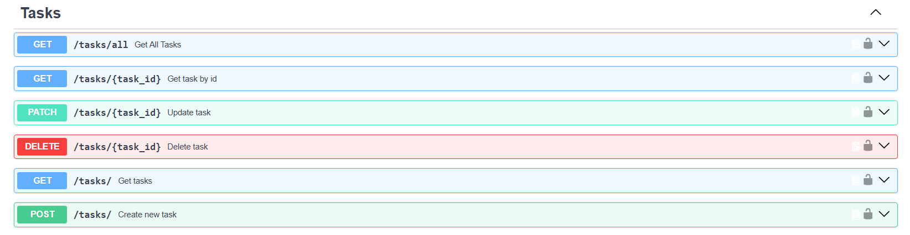
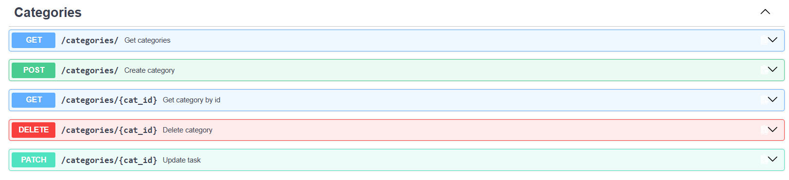
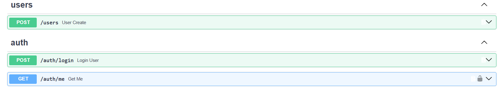
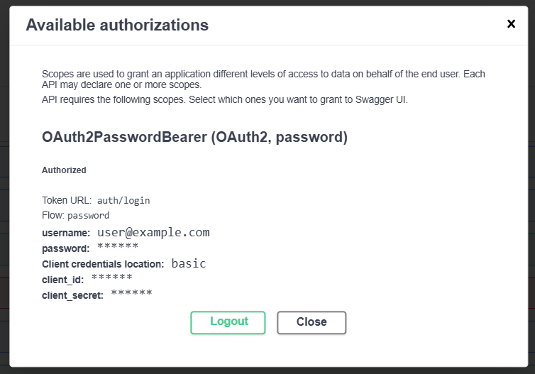
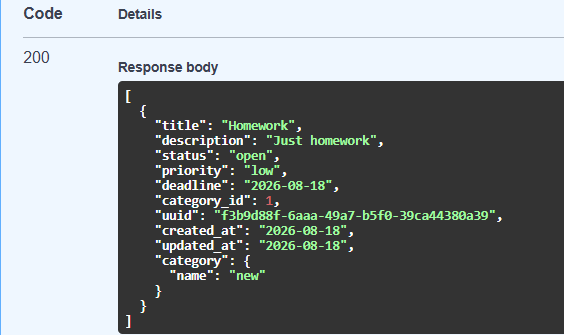
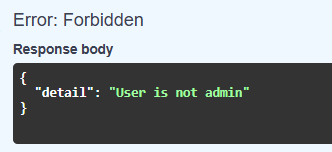
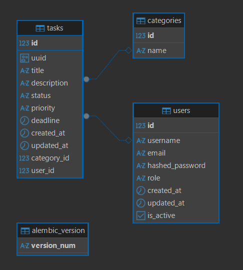

# FastAPI Task Manager

A REST API for task management with user authentication, categories, and access control. Built as a learning project to practice layered architecture (Router → Service → DB) in FastAPI.


## Features

- User registration and authentication via JWT
- Password hashing (Argon2)
- Full CRUD for tasks with priority, status, and deadline
- Task categories with unique names
- Access control: users can only view and edit their own tasks
- Input validation via Pydantic schemas
- Database schema migrations with Alembic

## Tech Stack

- **FastAPI** — web framework
- **SQLAlchemy** — ORM
- **PostgreSQL** — database
- **Alembic** — migrations
- **Pytest** — testing
- **Docker / Docker Compose** — containerization

## Architecture

The project follows a layered structure:

```
Router (handles HTTP requests, input validation)
   ↓
Service (business logic)
   ↓
Database (SQLAlchemy models, DB queries)
```

This separation is intentional: the router doesn't know database details, and the service layer doesn't depend on FastAPI — this makes the codebase easier to test and extend.

## Screenshots

> Task endpoints
> 
> Categories endpoints
> 
> User and auth endpoints
> 
> Successfull authorization
> 
> 
> Get title endpoint result
> 
> User role error
> 
> ER-diagram
> 

## Quick Start

The project runs with a single Docker Compose command — no need to manually install PostgreSQL or configure the environment.

```bash
git clone https://github.com/Alexandr1207/fastapi-task-manager.git
cd fastapi-task-manager

cp .env.example .env
# edit values in .env if needed

docker-compose up --build
```

Once running:
- API is available at `http://localhost:8000`
- Interactive docs (Swagger UI) — `http://localhost:8000/docs`

Migrations are applied automatically on container startup. To run them manually:

```bash
docker-compose exec app alembic upgrade head
```

## Example Requests

**Register a user**
```bash
curl -X POST http://localhost:8000/auth/register \
  -H "Content-Type: application/json" \
  -d '{"username": "testuser", "email": "test@example.com", "password": "SecurePass123"}'
```

**Log in and get a token**
```bash
curl -X POST http://localhost:8000/auth/login \
  -H "Content-Type: application/json" \
  -d '{"email": "test@example.com", "password": "SecurePass123"}'
```

**Create a task (requires Bearer token)**
```bash
curl -X POST http://localhost:8000/tasks \
  -H "Authorization: Bearer <your_token>" \
  -H "Content-Type: application/json" \
  -d '{"title": "First task", "priority": "high", "deadline": "2026-12-31"}'
```

## Tests

```bash
docker-compose exec app pytest
```

Covered: registration/login flow, invalid input handling, access to other users' or non-existent resources.

## Possible Improvements

- [ ] Pagination for task lists
- [ ] Filtering tasks by status/priority/category
- [ ] Rate limiting on auth endpoints
- [ ] Structured logging

## Author

Alexandr — [GitHub](https://github.com/Alexandr1207)
